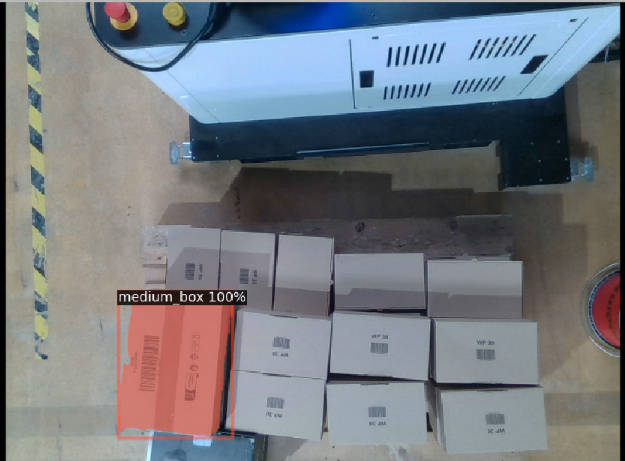
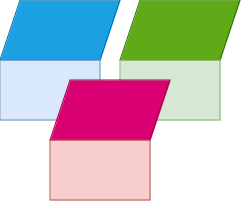
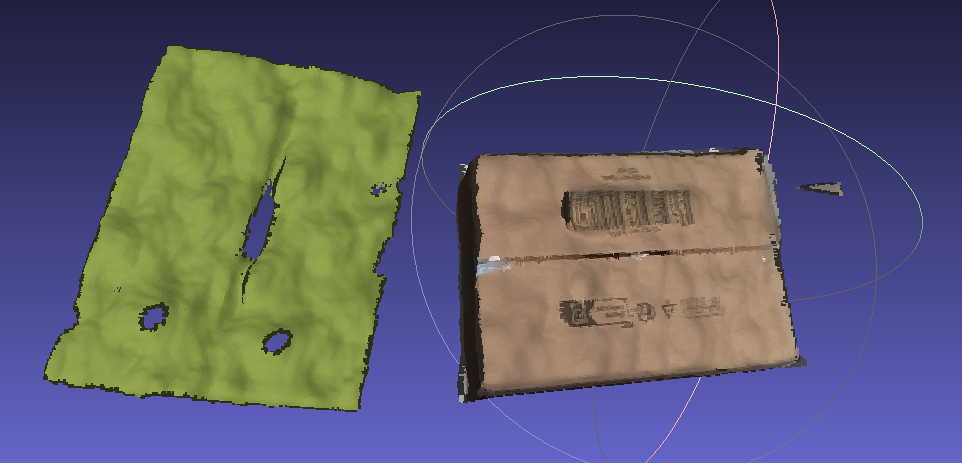
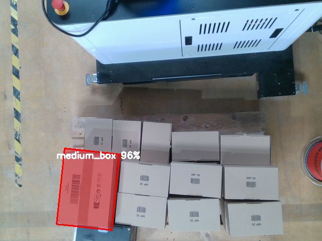
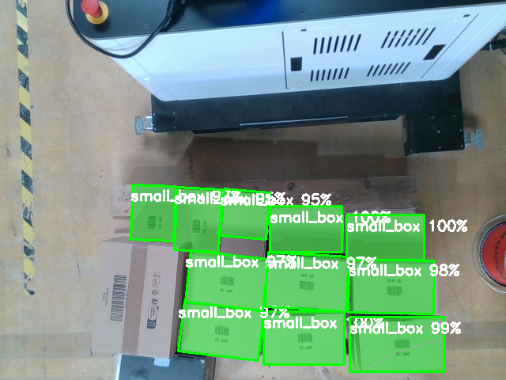
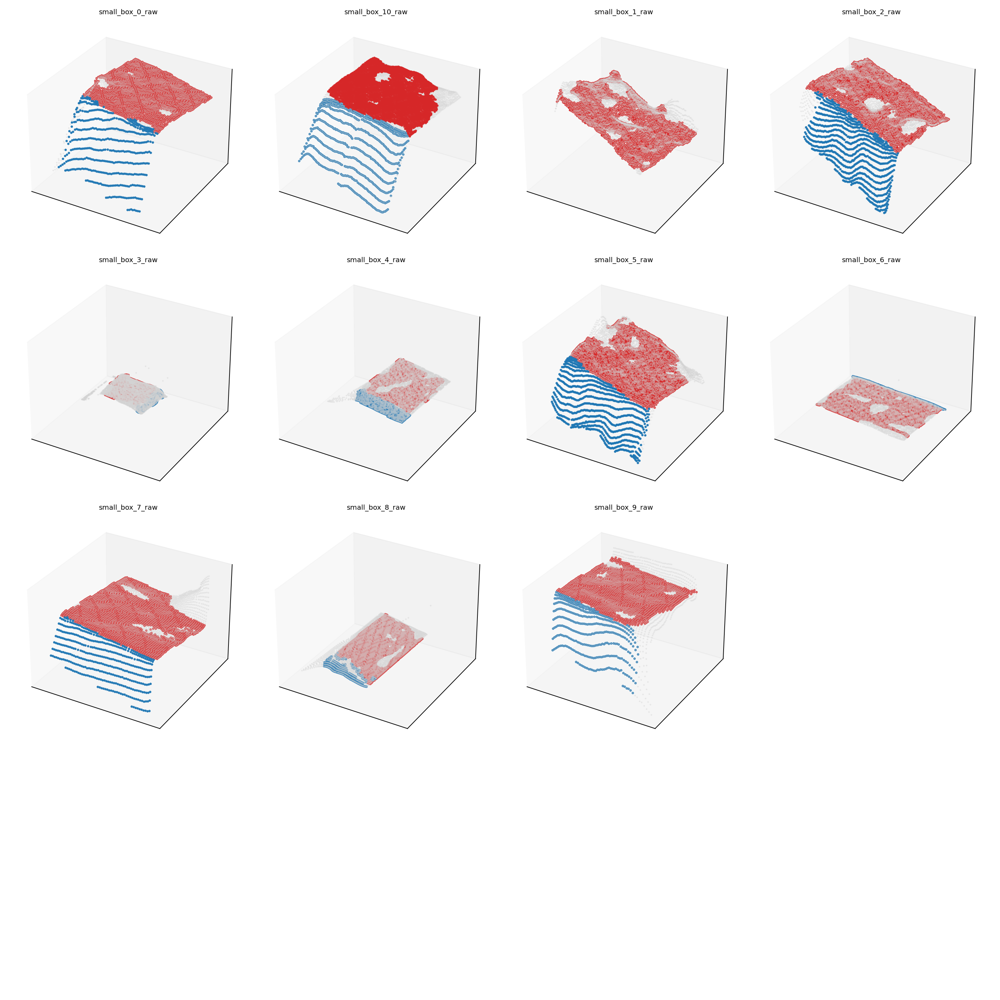
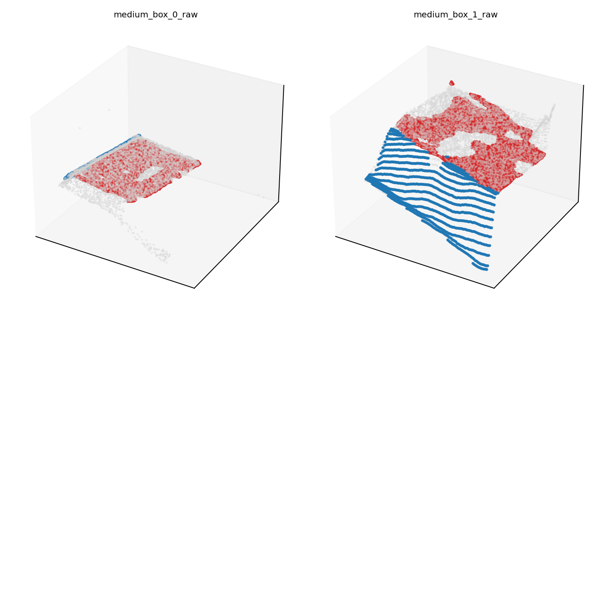
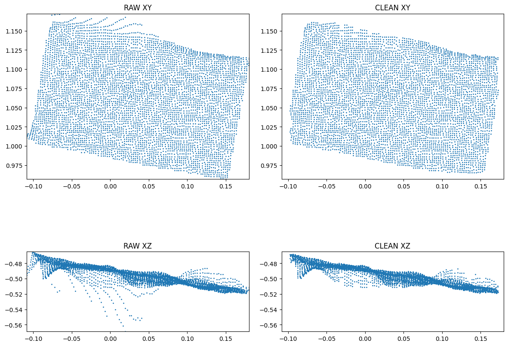
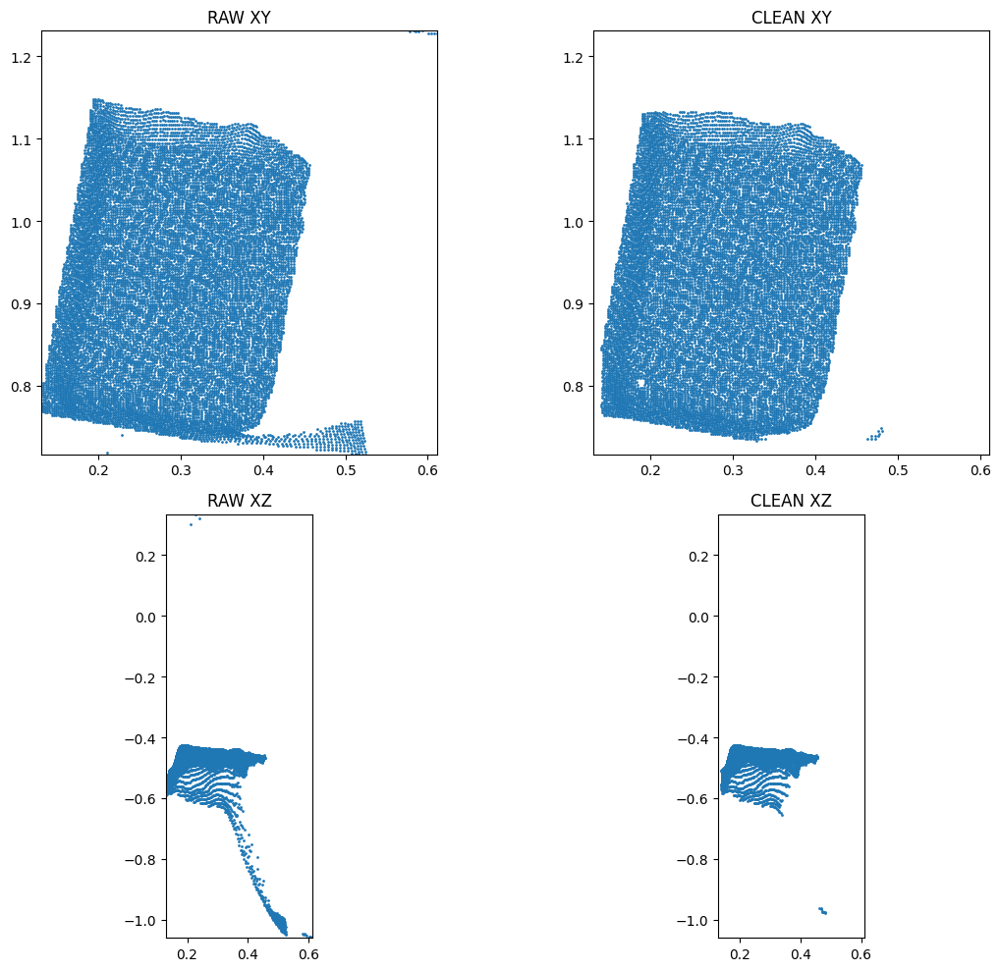

# smart_palletizer

[[_TOC_]]

## Introduction

Welcome to the [NEURA robotics](https://neura-robotics.com) Smart Palletizer challenge, the goal of this challenge is to assess your knowledge regarding various software development topics.

## Instructions

You are free to use **Python or C++**, preferably with Robotics Operating System ([**ROS**](https://www.ros.org)) either ROS1 or ROS2.

Please explain your **methodology** into solving the challenging tasks either via updating this readme file or via creating a separate Markdown file. 

> Please note that using [ChatGPT](https://chatgpt.com) is OK as long as you understand what you copy from there!.

## Tasks

Tasks have various complexity, optimal thing is to solve them all, however if you didn't solve some tasks please submit your code.

> Tasks are not interdependent.

### Input 


Data are provided in two formats:
1. ROSBAG:

    If you use **ROS**, please download and use the [ROS bag](https://drive.google.com/file/d/1ldM94Tz_I5NytLaQB8AydF_pxDG7EOkd/view?usp=sharing) which contains data needed to achieve the task.
2. RAW data:

    the [data](./data/) folder, there you can find two types of boxes:
    1. **small box**: dimensions: [0.340, 0.250, 0.095] in meters.
    2. **medium box**: dimensions: [0.255, 0.155, 0.100] in meters (only one box in the left bottom corner is visible).

    Provided data includes color/depth images in addition to box meshes, and other forms of data that is useful to solve the tasks.


### 1. 2D boxes detection

---

The goal of this task is to detect and small box, and medium box from color/depth images:

Note that you are free to use classical detection methods, or even [**synthetic**](https://github.com/DLR-RM/BlenderProc) data generated using the provided mesh files to achieve this task.

Here is an example of detected medium box:



### 2. Planar patches detection (3D)

---

The goal of this task is to detect planar surfaces in the point cloud of the boxes that might represent any of box sides and group them according to the box that they belong to.



### 3. Point Cloud post processing

---

Raw Point Clouds provided in the data folder are noisy, the goal of this task is to post-process the pointcloud to get a clean pointcloud for further processing, without jeopardizing the dimensions of the box too much.



### 4. Boxe Poses Estimation

---

This task aims to estimate 6D poses (Translation, Orientation) of the boxes in the scene:


## Evaluation

1. **Methodology** correctness into solving the challenge, please explain your efforts into solving the challenge rather than sending code only.
1. **Code validity** your code for the submitted tasks has to compile on our machines, hence we ask you kindly to provide clear instructions on how to compile/run your code, please don't forget to mention depndency packages with their versions to reproduce your steps.
3. **Code Quality** we provide empty templates e.g. `.gitignore`, `docker`, `CI`, Documentation, they are **optional**, keep in mind that best practices are appreciated and can add **extra points** to your submission.
4. **Visualization** it would be nice if you can provide visual results of what you have done: images, videos, statistics to represent your results.
5. **ChatGPT / Gemini** are useful tools if you use them wisely, however original work / ideas are always regarded with higher appreciation and gain more points, we remind you that we might fail the challenge if you misuse them (*e.g. copy paste code without understanding*).

## Documentation

Documenting your code is appreciated as you can explain the functionality in standardized way, hence we provide you with a Python template to compile your [documented functions/classes](https://www.geeksforgeeks.org/python-docstrings):

```sh
sudo apt-get install texlive-latex-base texlive-fonts-recommended texlive-fonts-extra texlive-latex-extra latexmk
#
cd smart_palletizer/docs
pip3 install -U pip
pip3 install -r requirements.txt
make clean && sphinx-apidoc -f -o source ../src/smart_palletizer
make html SPHINXBUILD="python3 <path_to_sphinx>/sphinx-build"
##----------
## Example:
##----------
# make html SPHINXBUILD="python3 $HOME/venv/bin/sphinx-build"
```
---

If you are using C++, then please refer to [Doxygen](https://www.doxygen.nl)

---
## My Results
All implementations scripts are in `src/smart_palletizer/` and are executed through the provided Makefile targets. Each task produces its corresponding visualizations and outputs inside the `outputs/` directory.

For this challenge, I worked entirely in Python and relied on the provided raw data rather than the ROS bag. Given the short timeline, I focused on producing correct solutions for the tasks rather than fully integrating ROS or setting up Sphinx-based documentation. The current submission reflects the most robust pipeline I could deliver within the allotted week.

### How to Run
#### Run individual tasks inside Docker or locally:

```sh
make task1   #2D detection
make task2   #planar patch detection
make task3   #point cloud cleaning
make task4   #6D pose estimation
```
---

#### Running inside Docker:
1. Build
```sh
make docker-build
```
2. Start the container
```sh
make docker-run
```
3. Then inside the container
```sh
make task1
make task2
make task3
make task3_demo #to get plots for this task
make task4
```


### Running locally:
```sh
pip install -r requirements.txt
pip install -e .
make task1
```

## Task 1-2D Detection

**Goal:** Detect small and medium box from color/depth images.

**Approach:**
Since the masks already give clean segmentations of each box, the problem reduces to extracting the visible regions, handling the one case of medium box occlusion and computing the bounding box.

- I began by loading the image with their masks. For each mask, I extracted the visible foreground region and fitted a rotated bounding box (this fit better!) based on the largest contour. 
- A simple confidence score was computed from how well the contour filled the fitted rectangle. 
- To prevent duplicate detections I used non-maximum suppression that uses the IoU metric. 
- Still the medium box was wrongly segmented as a combination of small boxes, despite being missing in the image. So I created a union mask of all small boxes and removed these pixels from each medium-box mask before calculating visibility fraction. The box which is atleast 50% visible would be considered.

- The final output consists of visualization images saved under `outputs/task1/`, showing the detected boxes with their confidence and mask overlays.





---
## Task 2 – Planar Patch Detection (3D)

**Goal:** Detect planar surfaces in the point cloud of the boxes that might represent any of box sides and group them according to the box that they belong to.

**Approach:**

Each raw .ply file contains a point cloud that represents a single box, so the grouping naturally happens per file. The main challenge is correctly extracting the planes that correspond to the box faces. I did something similar to this [blog](https://www.emergentmind.com/topics/random-sample-consensus-based-plane-detection).

- For each point cloud, I repeatedly ran RANSAC plane extraction. Each iteration identifies one dominant plane (usually a box side), and I removed its inliers before running RANSAC again to find the next face.
- RANSAC can sometimes split one physical face into multiple smaller patches, especially when edges are noisy. To handle this, I merged planes that had nearly identical normals and kept the largest patch from each group.
- Once merged, I sorted the patches by size and kept the strongest 1 or 2 planes per box, since these are the visible faces in the scene.
- To make sense of their orientation, I used the normal vector and extent of points to label a plane "top" or "side".

The outputs are grid visualizations saved in `outputs/task2/`. 




---
## Task 3 – Point Cloud Post-Processing

**Goal:** Post-process to get a clean pointcloud for further processing without jeopardizing the dimensions of the box too much.

**Approach:**

 The raw point clouds contain small (trailing) floating points, and artefacts around the edges. Cleaning helps us feel validated that the downstream algorithms see the real box surface mostly.

- I implemented the cleaning in `task3_pointcloud_processing.py` with optional visualizations in task3_demo.py.
- Since I didn't want to change the box shape, I stuck with a simple approach at the end:
    - I first cropped each cloud using a small percentile-based bounding box to remove far-outside points.
    - Conducted statistical outlier removal with slightly different parameters for small and medium boxes. This was identified with trial and error.
    - Cleaned clouds are saved as `*_clean.ply` alongside the raw versions in the ` data/small_box` and `data/medium_box` olders.

You can see some examples below:


---

## Task 4 – Boxes Poses Estimation

**Goal:** This task aims to estimate 6D poses (Translation, Orientation) of the boxes in the scene

**Approach:**
The key idea is that a box is a rigid object with three orthogonal directions, and these directions can be recovered from the geometry of the masked point cloud.

- I first converted all masked depth pixels into 3D camera-frame coordinates using the camera intrinsics.
- To extract the box’s orientation, I applied PCA to these 3D points. PCA naturally returns three orthogonal axes ordered by variance, which align well with the physical length width and height of the box.
- However, PCA does not guarantee that its axes match the true ordering of the box dimensions, so I reordered the axes using the known physical sizes of the small/medium boxes. This step helps assign a consistent meaning to each axis instead of relying on order of arbitrary eigenvector.
- PCA also doesn’t know which direction should face the camera, so I applied a small orientation correction to keep the coordinate frame right-handed.

The final rotation matrix R and centroid t form the camera-frame pose of the box. I projected the three basis vectors onto the image to visualize the pose purely as X/Y/Z arrows without rendering a full 3D box.

- To express the pose in a world coordinate system, I multiplied it with the provided cam2root.json transform. This yields a stable SE(3) estimate for each object, saved as a JSON file.

The implementation is in `task4_6dpose.py`, and a simple wrapper (`task4_pose3d.py`) calls the full pipeline for both 
`small_box/` and `medium_box/`. All images and pose matrices are written to `outputs/task4/`.
---


---
